<picture>
  
</picture>

# SAJIN CL
### <samp>MERN STACK DEVELOPER • FULL-STACK DEVELOPER • REACT DEVELOPER</samp>

  

## 🎭 USER_INFO

Hi, I’m Sajin CL, a `MERN Stack Developer`. passionate about building responsive, scalable, and user-friendly web applications with clean and efficient code.

  
  
  
  
  
  
  
  
  
  

<!--skills sections started here -->

## ⚔️ SKILLS

<picture>
  
</picture>

<!--
I SPECIALIZE IN THE FOLLOWING TECHNOLOGIES

  ###  LANGUAGES ⚡
  

###  FRONTEND 🎨

###  BACKEND ⚙️

###  DATABASE 🏭

### TOOLS 🛠️

--->

 
<!--skills sections ends here -->

---

<!--projects sections started here -->

  

⭐ PORTFOLIO WEBSITE :

`Personal developer portfolio built using modern frontend tooling and responsive UI.`
 
***Tech:*** `React.js, Vite, TailwindCSS`

---

⭐ HONEY ECOMMERCE WEBSITE :

`Premium honey e-commerce platform with secure payment integration, product catalog management, and responsive user experience.`

***Tech:*** `Next.js, MongoDB Atlas,Cloudinary, TailwindCSS`

---

⭐ MULTI VENDOR GROCERY ECOMMERCE :

`Multi‑vendor grocery platform with authentication, email OTP verification and vendor management.`

***Tech:*** `CSS, Bootstrap, Node.js, Express.js, MongoDB, Mongoose ODM, JWT Authentication`

---

⭐ ECOMMERCE ADMIN & USER PANEL :
 
`Server‑rendered ecommerce system with role separation and session authentication.`

***Tech:*** `CSS, Bootstrap, Node.js, Express.js, Handlebars.js, Session Authentication`

---

⭐ INSTAGRAM CLONE :

`Frontend social media UI clone using reusable components and dynamic state handling.`

***Tech:*** `Vite,TypeSript,React.js,TailwindCSS`

---

⭐ AK DECORATION SERVICE :

`A modern and responsive decoration service website showcasing event planning and decoration services, featuring service listings, image galleries, and contact options for client inquiries.`

***Tech:*** `Vite,React.js,TailwindCSS`

 
<!--projects sections ends here -->

<!--profile views started here -->

<!--profile views ends here -->

   
  <samp><i>"Focused on becoming a strong full-stack developer"</i></samp>

<!--github streak started here -->

  

<!--github streak ends here -->
 

<h3 align="center">⭐ Thanks for visiting my profile! ⭐</h3>

<picture>
  
</picture>

---

<!-- Badges List -->

   
  <samp><i>"Let's Connect"</i></samp>

